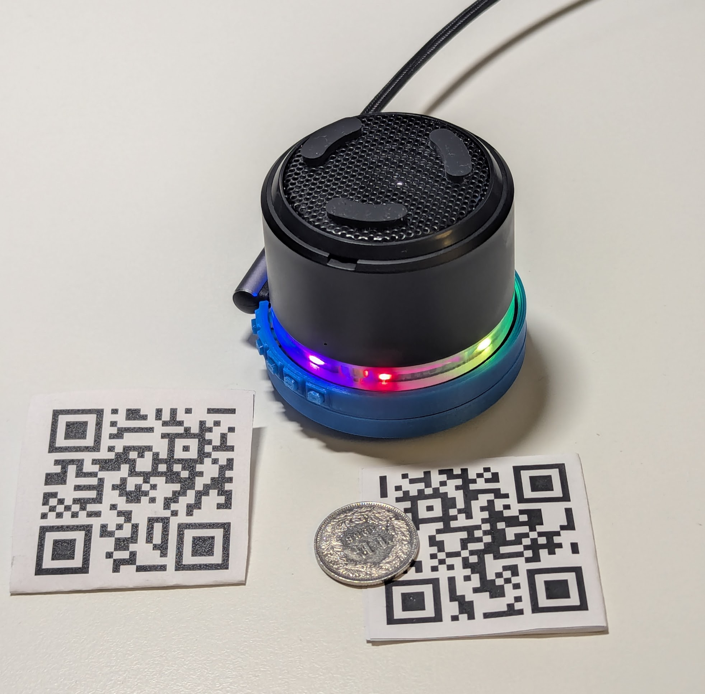

# Zauberbox

Zauberbox is a small audio player for children built on the ESP32-S3-AUDIO-Board.
Music and stories live on the microSD card in numbered album folders such as
`001`, `002`, and `003`.

A child starts playback by showing a QR code to the camera. A parent can manage
albums and configuration over Wi-Fi.

Main docs:

- [`SPECIFICATION.md`](./SPECIFICATION.md)
- [`PLAN.md`](./PLAN.md)
- [`AUDIO_NOTES.md`](./AUDIO_NOTES.md)
